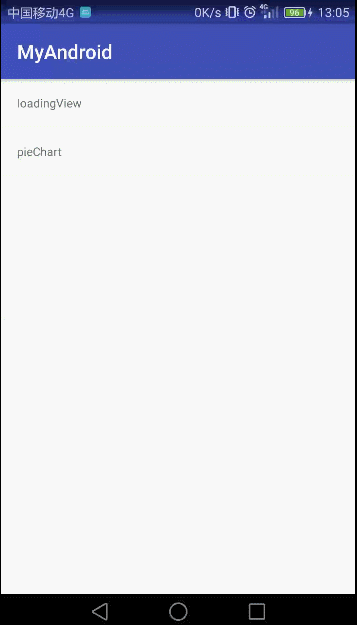
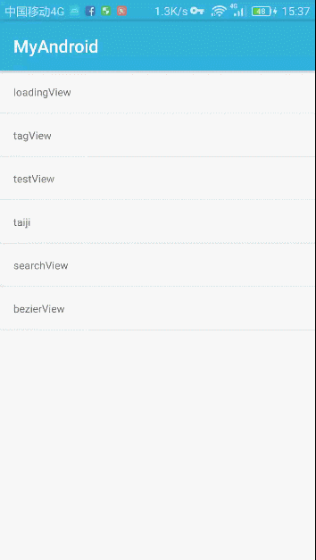
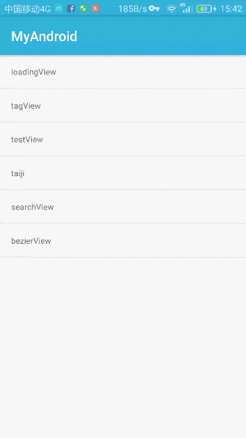
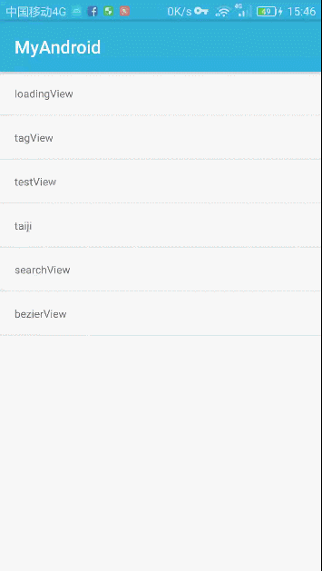
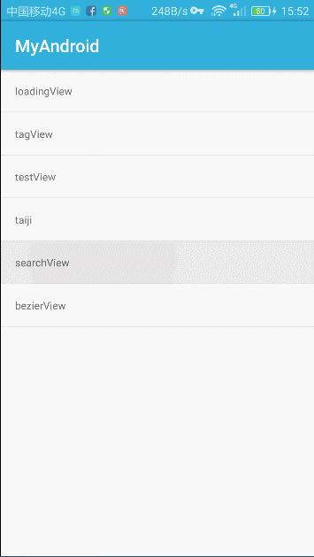
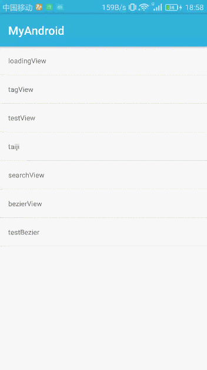

# README #

　　自定义控件学习
> 读懂他人的代码，然后可以按照自己的需求更改，就基本达标了。

## 1、UC浏览器加载动画 ##

　　[实现思路](doc/uc_read.md)

　　

## 2、标签视图控件实现 ##

　　

## 3、测试动画控件 ##

　　目前做的是（正弦函数变化曲线）

　　

## 4、一个画布旋转动画 ##

　　用两个path画出双鱼图，然后旋转画布达到动画效果，GIF受帧数限制效果不好。

　　

## 5、AndroidNote学习成果 ##

　　感谢GcsSloop的笔记，让我学到了很多知识，这里实现了SearchView，添加了点击事件。

　　[AndroidNote链接](https://github.com/GcsSloop/AndroidNote)

　　

## 6、贝塞尔曲线学习 ##

　　根据dodola的MetaballLoading项目进行学习，理解并重现效果

　　[MetaballLoading链接](https://github.com/dodola/MetaballLoading)

　　

## 7、QQ消息气泡拖拽实现 ##

　　实现拖拽拉扯效果，弹性动画未完成

　　

