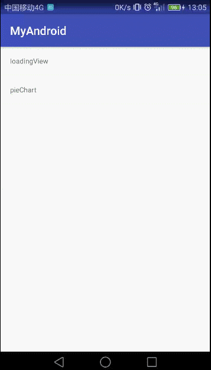

# README #

　　最近家里网络出了点问题，手机加载网页老是很慢，每次都盯着UC浏览器的加载页面发呆。时间一长发现那个加载动画还挺不错的，而且不难实现，就两个圈不断地放大缩小。于是，就写了一下练练手。

# 步骤 #

　　我们要了解实现一个自定义view的大概的流程，这里你们可以去看鸿神的博客，[链接在此，速来参拜](http://blog.csdn.net/lmj623565791/article/details/24252901)

#### 分析 ####

　　UC的加载界面是两个圈交替的扩大缩小，非常容易理解，实现也很简单，对于我这种自定义视图的初学者来说，是一个很好上手的锻炼机会。难点在于，交替切换动画，还有计算动画速度上，但这也不算难其实。

> 代码看不懂？再写一次，还看不懂，那就再写一次。反反复复，对待编程基础要有愚公的精神。

#### 第一步 定义View的属性 ####

　　首先我们需要两个颜色，左右两个圈各一个，然后是动画周期。然后——————恩，没有然后了。代码如下(这是values下的attrs.xml这都不懂你就非常尴尬了)

	<?xml version="1.0" encoding="utf-8"?>
	<resources>
    <attr name="mColor" format="color"/>
    <attr name="mBackgroundColor" format="color"/>
    <attr name="mDuring" format="integer"/>
    <declare-styleable name="UCloading">
        <attr name="mColor" />
        <attr name="mBackgroundColor" />
        <attr name="mDuring" />
    </declare-styleable>
	</resources>

　　ps:backgroundcolor就是另外一个圆的颜色，我这里只是顺便把之前定义的背景色的参数借来用一下

#### 第二步 创建一个类 ####

　　这里类名字一般命名与attr中保持一致UCloading，当然这二者并没有什么直接联系。
　　然后去布局文件中添加View,记得给出上面这些参数,app:mColor的app是可以自己改名字的，记得在XML文件声明就行了xmlns:app="http://schemas.android.com/apk/res-auto",如果是eclipse的话后面的res-auto得换成你的包路径，具体怎么弄去网上查吧

	<com.jianyuyouhun.library.view.UCloading
        android:id="@+id/loading"
        app:mColor="#2d92da"
        app:mBackgroundColor="#3e3e3e"
        app:mDuring="400"
        android:layout_width="50dp"
        android:layout_height="50dp" />

　　这时候你是不能预览这个控件的，代码都没写，肯定啥也没有啊。

#### 第三步 构造器 ####

　　UCloading继承view，并实现其带有三个参数的构造方法。其他构造方法依次调用该方法，传入的参数也需要作出修改。代码如下：

	public UCloading(Context context){
        this(context, null);
    }

    public UCloading(Context context, AttributeSet attrs){
        this(context, attrs, 0);
    }

    public UCloading(Context context, AttributeSet attrs, int defStyleAttr) {
        super(context, attrs, defStyleAttr);
        TypedArray a = context.getTheme().obtainStyledAttributes(attrs, R.styleable.UCloading, defStyleAttr, 0);
        int n = a.getIndexCount();
        for (int i = 0; i < n; i++){
            int attr = a.getIndex(i);
            if (attr == R.styleable.UCloading_mColor) {
                mColor = a.getColor(attr, Color.BLUE);
            }else if (attr == R.styleable.UCloading_mBackgroundColor){
                mBackgroundColor = a.getColor(attr, Color.GRAY);
            }else if (attr == R.styleable.UCloading_mDuring){
                mDuring = a.getInt(attr, 300);
            }
        }
        a.recycle();
        paint = new Paint();
		handler = new Handler(){
            @Override
            public void handleMessage(Message msg) {
                super.handleMessage(msg);
                switch (msg.what){
                    case 1:
                        if (!handlerFlag){
                            leftRadius = minRadius;
                            rightRadius = maxRadius;
                            handlerFlag=true;
                            start();
                        }else {
                            start();
                        }
                        break;
                }
            }
        };
	}

　　ps:四个参数的构造方法api版本要求太高，目前不用理会。

　　这个构造器看上去好像很多，其功能目的是获取我们自定义的属性。对了属性忘记给出了，自己去看项目代码吧，都有注释。

#### 第四步 ####

　　画圈，不停的画圈，先要把画布分成四份，然后设定比例来得到半径变化区间。接着画笔设置属性，包括颜色，画笔宽度，抗锯齿，实心圆设置。

　　然后再去建立线程来重绘界面，当然规则要定好：

	new Thread(){
            @Override
            public void run() {
                if (flag){
                    leftRadius--;
                    rightRadius++;
                    if (leftRadius==minRadius){
                        flag = false;
                    }
                }else {
                    leftRadius++;
                    rightRadius--;
                    if (leftRadius==maxRadius){
                        flag = true;
                    }
                }
                try {
                    Thread.sleep(speed);
                } catch (InterruptedException e) {
                    e.printStackTrace();
                }
                postInvalidate();
            }
        }.start();

　　当然这个线程是么时候启用是需要注意的。

　　对了，周期计算其实很简单，得出半径区间，然后 mDuring / range,就是你的刷新等待间隔了。

#### 第五步 ####

　　对外公布set方法便于代码中去设置属性：

	public void setLoadColor(int color){
        this.mColor = color;
        autoStart = false;
    }
    public void setLoadBackgroundColor(int color){
        this.mBackgroundColor = color;
        autoStart = false;
    }
    public void setDuring(int during){
        this.mDuring = during;
        autoStart = false;
    }
    public void startLoading(){
        autoStart = true;
        postInvalidate();
    }

　　ps:每次设置属性时都要设置autoStart标志，然后由开发者手动调用startLoading方法启动动画。

# 总结 #

　　代码都被我分开展示了，可能你有些难以理解，那么这里我介绍一下全部流程。分别是，attr设置属性，定义class继承view，构造方法重写和获取属性，画圈规则实现，设置动画起点（handler.sendEmptyMessage(1)），handler修改标志避免第二次重新给半径赋值，开始绘制并实时修改半径，直到半径达到最大或者最小。这就是一个周期动画的全部过程。具体就看代码去理解吧。

　　当然效果图不会少了。

